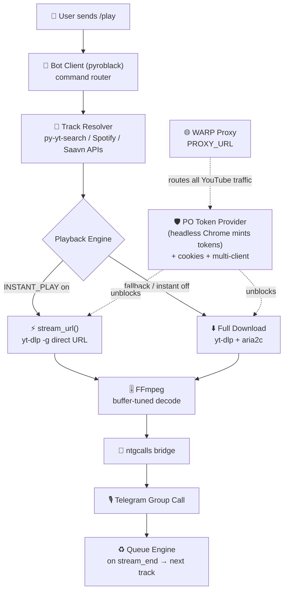

<div align="center">


<br>

<a href="https://github.com/venombolteop/VenomMusic"></a>

*A power-packed, feature-rich group voice-chat music bot built for **non-stop playback** — crystal-clear audio, full video streams, premium emoji UI and a battle-tested YouTube pipeline.*

<br>

[](https://github.com/venombolteop/VenomMusic/stargazers)
[](https://github.com/venombolteop/VenomMusic/network/members)
[](https://github.com/venombolteop/VenomMusic/issues)
[](./LICENSE)
[](https://www.python.org/)
[](https://github.com/venombolteop/VenomMusic/commits/main)
[](https://github.com/venombolteop/VenomMusic)
[](https://github.com/venombolteop/VenomMusic)

<br>

<a href="https://t.me/venom_chatting"></a>
<a href="https://t.me/TomatoFist"></a>
<a href="https://t.me/ll_dark_poison_ll"></a>

<br>
<br>

<a href="https://dashboard.heroku.com/new?template=https://github.com/venombolteop/VenomMusic"></a>
<a href="https://render.com/deploy?repo=https://github.com/venombolteop/VenomMusic"></a>
<a href="#-deploy-with-docker"></a>
<a href="#-deploy-on-a-vps--local-host"></a>

</div>

---

## 📑 Table of Contents

- [About](#-about-venom-music)
- [Architecture — How It Works](#-architecture--how-it-works)
- [Features](#-features-in-depth)
- [Supported Platforms](#-supported-platforms)
- [Commands](#-commands)
- [Deployment](#-deployment)
  - [Heroku](#-deploy-on-heroku) · [Render](#-deploy-on-render) · [Docker](#-deploy-with-docker) · [VPS + systemd](#-deploy-on-a-vps--local-host)
- [Environment Variables](#-environment-variables)
- **Advanced Guides**
  - [Proxy Setup — Cloudflare WARP](#-proxy-setup-optional--cloudflare-warp-free)
  - [PO Token Browser Setup](#-po-token-browser-setup-optional--fixes-youtube-sign-in-to-confirm-youre-not-a-bot)
  - [YouTube Cookies](#-youtube-cookies-optional-but-recommended)
- [Troubleshooting & FAQ](#-troubleshooting--faq)
- [Project Structure](#-project-structure)
- [Repo Showcase](#-repo-showcase)
- [Support & Credits](#-support--credits)

---

## ☠️ About Venom Music

**Venom Music** is a next-generation voice-chat music player for Telegram groups. It streams audio & video directly into group calls using a fleet of **assistant accounts** (userbot sessions), backed by a hardened YouTube extraction pipeline:

> 🧲 **PO Token minting** · 🍪 **Cookie auth** · 🌐 **WARP proxy routing** · ♻️ **Multi-layer fallbacks**

No half-measures: when YouTube blocks one extraction path, Venom silently falls through four more until the music plays.

| | |
|:---|:---|
| ⚡ **Instant Play** | Direct-stream URLs start in seconds — download only as a last resort |
| 🎬 **Audio + Video** | Songs or full music videos, up to 4K, straight into the VC |
| 👥 **Assistant Fleet** | Load-balanced userbots dodge FloodWaits and join limits automatically |
| 💎 **Premium Emoji UI** | Custom-emoji buttons, progress bars and animated player cards |
| 🔁 **Full Player Control** | Skip · loop · shuffle · seek · pause · resume · autoend |
| 🌐 **Multilingual** | English · Hindi · Arabic · Turkish · Sorani Kurdish |
| 🛡️ **Moderation Suite** | Global bans, chat blacklists, sudoers, broadcast, maintenance mode |
| 🗄️ **MongoDB Persistence** | Queues, playlists, settings and stats survive every restart |

### ⚔️ How Venom Stacks Up

| Capability | ⚡ Venom Music | Typical Yukki fork | Plain pytgcalls bot |
|:-----------|:--------------:|:------------------:|:-------------------:|
| PO Token minting (bot-check bypass) | ✅ built-in | ❌ | ❌ |
| Multi-layer extraction fallbacks | ✅ 4 layers | ⚠️ partial | ❌ |
| Proxy-aware download-first switching | ✅ automatic | ❌ | ❌ |
| Premium custom-emoji player UI | ✅ | ❌ | ❌ |
| Assistant fleet load-balancing | ✅ | ⚠️ partial | ❌ |
| 5 languages out of the box | ✅ | ⚠️ varies | ❌ |

<br>


---

## 🏗️ Architecture — How It Works



**The playback pipeline in detail:**

1. **Command layer** — `/play` resolves the query via fast search APIs and validates duration limits.
2. **Extraction layer** — `yt-dlp` fetches a direct media URL (`stream_url()`, ~2–7 s). When YouTube's bot-check intervenes, the **WPC PO Token provider** spins up headless Chromium to mint fresh tokens, cookies authenticate the session, and the `tv/mweb/web` client trio plus progressive itag-18 provide SABR-proof fallbacks.
3. **Network layer** — all YouTube traffic is routed through `PROXY_URL` when configured; under a proxy the bot auto-switches to *download-first* mode because googlevideo URLs are IP-bound.
4. **Transport layer** — FFmpeg decodes with tuned buffer parameters and feeds raw frames into `ntgcalls`, which bridges them into Telegram's group call via the assistant account.
5. **Queue engine** — a `stream_end` event pops the next track from MongoDB-backed queues, so playback continues hands-free until the queue is empty.

---

## ✨ Features In Depth

<details open>
<summary><b>🎧 Playback</b></summary>

- **Instant streaming first** — direct URLs are probed before falling back to full downloads
- **Video up to 4K** with per-chat configurable audio/video bitrates
- **Loop** a single track or the entire queue, **shuffle**, **seek forward/backward**
- **Force play** to cut the current track immediately
- **Auto-end** empty calls and **auto-leave** idle assistants (configurable timers)
- **Channel play** — linked-channel groups get their own playback flow

</details>

<details>
<summary><b>🛡️ YouTube Hardening Pipeline</b></summary>

- **PO Token minting** via [`yt-dlp-getpot-wpc`](https://github.com/coletdjnz/yt-dlp-getpot-wpc) — headless browser defeats *"Sign in to confirm you're not a bot"*
- **Netscape cookie support** — drop any exported `cookies.txt` into `cookies/`
- **Multi-client strategy** — `tv` → `mweb` → `web` clients, then progressive itag 18
- **JS runtime fallbacks** — node → bun → deno → default extractor chains
- **Proxy-aware everywhere** — yt-dlp, aria2c and ffmpeg probes all honor `PROXY_URL`
- **Stale-file cleanup** — corrupted/partial downloads (<10 KB) auto-purge and re-fetch

</details>

<details>
<summary><b>💎 Interface</b></summary>

- **Premium custom emojis** on every button, icon and player card
- **Live progress bars** with thumbnail artwork generated per track
- **Inline search** results playable without commands
- **Clean mode** auto-deletes now-playing spam after playback
- **Play logger** — rich log cards posted to your log group

</details>

<details>
<summary><b>👑 Owner & Moderation</b></summary>

- Global ban/unban, per-user block, chat blacklisting
- Broadcast to all active chats, sudoer management
- Heroku config-var management from chat (`/setvar`, `/getvar`)
- Git-based `/update` and `/restart`, live speedtest & system stats

</details>

---

## 🎵 Supported Platforms

| Platform | Audio | Video | Playlists | Notes |
|:---------|:-----:|:-----:|:---------:|:------|
| ▶️ **YouTube** | ✅ | ✅ | ✅ | Search, links, Shorts; PO-Token hardened |
| 🟢 **Spotify** | ✅ | ⛔ | ✅ | Metadata resolved → streamed via YouTube |
| 🍎 **Apple Music** | ✅ | ⛔ | ✅ | Same resolution pipeline |
| 🟣 **JioSaavn** | ✅ | ⛔ | ✅ | Native high-quality downloads |
| 🔴 **Resso** | ✅ | ⛔ | ⛔ | Direct track fetch |
| 🟠 **SoundCloud** | ✅ | ⛔ | ⛔ | Native downloads |
| 📎 **Telegram Files** | ✅ | ✅ | ⛔ | Reply to any audio/video to play it |
| 📡 **Direct Links** | ✅ | ✅ | ⛔ | m3u8 / index / radio / live streams |

---

## 🎮 Commands

<details open>
<summary><b>🎧 Play Commands</b></summary>
<br>

| Command | Description |
|:--------|:------------|
| `/play <query>` | Play audio by name or link (searches if not a URL) |
| `/vplay <query>` | Play video by name or link |
| `/playforce` / `/vplayforce` | Instantly replace the current track |
| `/channelplay` | Play in a linked channel group |
| `/stream <url>` | Stream m3u8 / index / radio / live links |
| `/playlist` | View your saved playlists |
| `/addplaylist <name>` | Save current queue to a playlist |
| `/playplaylist <name>` | Play a saved playlist |
| `/deleteplaylist <name>` | Delete a saved playlist |
| `/playmode` | Toggle Direct ↔ Search playback mode |
| `/instantplay` | Toggle instant URL streaming |

</details>

<details>
<summary><b>🛠️ Admin Commands</b></summary>
<br>

| Command | Description |
|:--------|:------------|
| `/pause` / `/resume` | Pause & resume playback |
| `/skip` | Skip to the next queued track |
| `/stop` / `/end` | Stop and clear the queue |
| `/shuffle` | Shuffle remaining queue |
| `/loop [n]` | Loop track n× times, or forever |
| `/seek <time>` / `/seekback <time>` | Jump forward / backward |
| `/auth` / `/unauth` / `/authusers` | Manage authorized users |
| `/mute` / `/unmute` | Mute / unmute the assistant itself |
| `/reboot` | Restart the voice-call bridge |

</details>

<details>
<summary><b>🧰 Tools & Fun</b></summary>
<br>

| Command | Description |
|:--------|:------------|
| `/song <name>` / `/video <name>` | Download audio / video files |
| `/lyrics <song>` | Fetch lyrics |
| `/queue` / `/player` | Inspect queue & now-playing |
| `/radio` | Browse live radio stations |
| `/ping` · `/stats` · `/speedtest` | Latency · uptime/system stats · network test |
| `/lang` | Switch bot language |
| `/id` | Get IDs of chats, users or replied media |
| `/font <text>` | Styled unicode fonts |
| `/love @user` | Romance calculator 💘 |
| `/sg <username>` | Telegram username history search |
| `/telegraph` | Upload replied media to Telegraph |

</details>

<details>
<summary><b>👑 Sudo / Owner Commands</b></summary>
<br>

| Command | Description |
|:--------|:------------|
| `/addsudo` / `/delsudo` / `/sudolist` | Manage sudo users |
| `/broadcast` | Send to all chats using the bot |
| `/gban` / `/ungban` | Global bans |
| `/block` / `/unblock` | Bot-level DM blocking |
| `/blacklistchat` / `/whitelistchat` | Chat blacklist management |
| `/logger` | Toggle log-group play cards |
| `/maintenance` | Maintenance mode gate |
| `/autoend` | Auto-close empty VCs |
| `/videolimit` / `/videomode` | Video call limits & quality mode |
| `/authorize` / `/unauthorize` | Private-bot access list |
| `/activevoice` / `/activevideo` | List live calls |
| `/update` | `git pull` upstream and restart |
| `/restart` | Restart bot process |
| `/log` / `/usage` | Heroku dyno logs & usage |
| `/setvar` / `/getvar` / `/delvar` | Heroku config vars from chat |

</details>

<br>

> 📌 **Prefixes:** `/` `!` `%` `,` `@` `#` — English shown; every command is localized for all supported languages.


## 🚀 Deployment

> **Prerequisites:** an [API_ID/API_HASH](https://my.telegram.org) pair, a [@BotFather](https://t.me/BotFather) token, 1+ assistant session strings, a MongoDB instance and a log-group ID.

<details open>
<summary><b>⚡ TL;DR — VPS in 60 seconds</b></summary>

```bash
sudo apt-get update && sudo apt-get install -y python3-pip ffmpeg git
git clone https://github.com/venombolteop/VenomMusic && cd VenomMusic
pip3 install -U -r requirements.txt && cp sample.env .env && nano .env   # fill vars
bash start
```

</details>

### ☁️ Deploy on Heroku

<a href="https://dashboard.heroku.com/new?template=https://github.com/venombolteop/VenomMusic"></a>

One click → fill vars → deploy. Worker dyno included via `heroku.yml`.

### 🌐 Deploy on Render

<a href="https://render.com/deploy?repo=https://github.com/venombolteop/VenomMusic"></a>

Uses `render.yaml` blueprint — fill env vars in the dashboard.

### 🐳 Deploy with Docker

```bash
git clone https://github.com/venombolteop/VenomMusic && cd VenomMusic
cp sample.env .env                # then edit .env with your values
docker build -t venommusic .
docker run -d --name venommusic \
  --env-file .env \
  --restart unless-stopped \
  venommusic
```

### 🖥️ Deploy on a VPS / Local Host

**1. System prep**
```bash
sudo apt-get update && sudo apt-get upgrade -y
sudo apt-get install -y python3-pip ffmpeg git
sudo pip3 install -U pip
```

**2. Clone & install**
```bash
git clone https://github.com/venombolteop/VenomMusic && cd VenomMusic
pip3 install -U -r requirements.txt
```

**3. Configure**
```bash
cp sample.env .env
nano .env        # fill ALL required variables, Ctrl+O save, Ctrl+X exit
```

**4. Test-run** *(recommended before systemd)*
```bash
bash start
```
> Prefer tmux so it survives disconnects: `sudo apt install tmux && tmux` → run `bash start` → detach `Ctrl+B` `D`.

**5. Run as a systemd service** *(production-grade, auto-restart on boot/crash)*

Create `/etc/systemd/system/venommusic.service`:
```ini
[Unit]
Description=VenomMusic Telegram Music Bot
After=network-online.target
Wants=network-online.target

[Service]
Type=simple
User=ubuntu                       # your linux user
WorkingDirectory=/home/ubuntu/VenomMusic
ExecStart=/usr/bin/python3 -u -m VenomX
Restart=always
RestartSec=5
LimitNOFILE=1048576
StandardOutput=append:/home/ubuntu/VenomMusic/bot.log
StandardError=append:/home/ubuntu/VenomMusic/bot.log

[Install]
WantedBy=multi-user.target
```

Enable & control it:
```bash
sudo systemctl daemon-reload
sudo systemctl enable --now venommusic   # start now + on boot
systemctl status venommusic              # health check
tail -f ~/VenomMusic/bot.log             # live logs
sudo systemctl restart venommusic        # apply .env/code changes
```


## ⚙️ Environment Variables

### Required

| Variable | Description |
|:---------|:------------|
| `API_ID` / `API_HASH` | Telegram API credentials from [my.telegram.org](https://my.telegram.org) |
| `BOT_TOKEN` | Bot token from [@BotFather](https://t.me/BotFather) |
| `STRING_SESSIONS` | Assistant account session strings — comma/space separated, add more to scale |
| `MONGO_DB_URI` | MongoDB connection string ([free cluster](https://www.mongodb.com/cloud/atlas)) |
| `LOGGER_ID` | Private group ID where play logs land |
| `OWNER_ID` | Your numeric Telegram user ID(s) |

### Playback & Limits

| Variable | Default | Description |
|:---------|:-------:|:------------|
| `DURATION_LIMIT` | `5400` | Max track length (seconds) for VC playback |
| `SONG_DOWNLOAD_DURATION_LIMIT` | `5400` | Max duration for `/song` `/video` downloads |
| `PLAYLIST_FETCH_LIMIT` | `255` | Max tracks fetched per playlist |
| `VIDEO_STREAM_LIMIT` | `999` | Concurrent video calls allowed |
| `TG_AUDIO_FILESIZE_LIMIT` / `TG_VIDEO_FILESIZE_LIMIT` | `1073741824` | Telegram file size caps (bytes) |
| `INSTANT_PLAY` | `True` | Stream direct URLs first instead of downloading |
| `PRIVATE_BOT_MODE` | `False` | Only whitelisted chats can use the bot |
| `AUTO_LEAVING_ASSISTANT` / `ASSISTANT_LEAVE_TIME` | off / `5800` | Auto-leave assistants after idle seconds |
| `CLEANMODE_MINS` | `5` | Minutes before clean-mode wipes messages |
| `SET_CMDS` | `True` | Auto-register command menu in Telegram |

### Networking & YouTube

| Variable | Description |
|:---------|:------------|
| `PROXY_URL` | HTTP/SOCKS5 proxy for all YouTube traffic — e.g. `http://127.0.0.1:40000`. See [WARP guide](#-proxy-setup-optional--cloudflare-warp-free) |
| `WPC_BROWSER_PATH` | Chrome/Chromium binary path for the PO Token provider. Auto-detected if unset — see [browser setup](#-po-token-browser-setup-optional--fixes-youtube-sign-in-to-confirm-youre-not-a-bot) |

### Integrations & Misc

| Variable | Description |
|:---------|:------------|
| `SPOTIFY_CLIENT_ID` / `SPOTIFY_CLIENT_SECRET` | Spotify API keys for metadata resolution |
| `SUPPORT_CHANNEL` / `SUPPORT_GROUP` | Links shown inside the bot |
| `UPSTREAM_REPO` / `UPSTREAM_BRANCH` / `GIT_TOKEN` | Source repo for `/update` |
| `GITHUB_REPO` | Repo link shown in `/start` |
| `HEROKU_API_KEY` / `HEROKU_APP_NAME` | Enables Heroku var/log commands |
| `EXTRA_PLUGINS` / `EXTRA_PLUGINS_REPO` | Load external plugin packs |
| `START_IMG_URL` etc. | Override UI artwork URLs |

> 📄 Full reference: [`sample.env`](sample.env)

---

## 🌐 Proxy Setup (Optional) — Cloudflare WARP (Free)

Route YouTube / yt-dlp traffic through a local HTTP proxy — ideal when YouTube rate-limits or geo-blocks your VPS IP.

> **TL;DR:** Install WARP → `warp-cli mode proxy` → connect → put `http://127.0.0.1:40000` into `.env` as `PROXY_URL`.

<details>
<summary><b>📖 Full step-by-step WARP guide</b></summary>

### 1) Install Cloudflare WARP (Debian/Ubuntu)

```bash
curl -fsSL https://pkg.cloudflareclient.com/pubkey.gpg | sudo gpg --yes --dearmor -o /usr/share/keyrings/cloudflare-warp-archive-keyring.gpg
echo "deb [signed-by=/usr/share/keyrings/cloudflare-warp-archive-keyring.gpg] https://pkg.cloudflareclient.com/ $(lsb_release -cs) main" | sudo tee /etc/apt/sources.list.d/cloudflare-client.list
sudo apt-get update && sudo apt-get install -y cloudflare-warp
```

### 2) Register + enable proxy mode

```bash
sudo warp-cli --accept-tos registration new   # one-time registration
sudo warp-cli mode proxy                      # local HTTP proxy mode
sudo warp-cli proxy port 40000                # optional: change port
sudo warp-cli connect                         # connect
warp-cli status                               # must show Connected + WarpProxy
```

### 3) Verify the listener

```bash
ss -tlnp | grep 40000                                   # confirm listening
curl -x http://127.0.0.1:40000 https://api.ipify.org    # show exit IP via proxy
```

Expected:
```text
LISTEN 127.0.0.1:40000
Mode: WarpProxy on port 40000
```

### 4) Add to `.env`

```env
PROXY_URL=http://127.0.0.1:40000
```

Then restart the bot. **Under a proxy the bot automatically switches to download-first mode** — googlevideo URLs are bound to the proxy's exit IP, so ffmpeg plays the locally downloaded file instead of the remote URL.

</details>

### Useful WARP commands

| Command | Purpose |
|:--------|:--------|
| `warp-cli status` / `settings` | Connection status / mode + port |
| `warp-cli connect` / `disconnect` | Toggle tunnel |
| `warp-cli mode proxy` | Enable local HTTP proxy |
| `warp-cli proxy port 40000` | Set listen port |
| `curl -x http://127.0.0.1:40000 https://ifconfig.me` | Show proxy exit IP |

### SOCKS5 alternative

```env
PROXY_URL=socks5://127.0.0.1:1080
```

> ⚠️ Proxy is **env-only** (`PROXY_URL`) — the bot never touches your running proxy config.

---

## 🤖 PO Token Browser Setup (Optional) — fixes YouTube "Sign in to confirm you're not a bot"

YouTube sometimes blocks datacenter IPs with:

```text
ERROR: [youtube] <video_id>: Sign in to confirm you're not a bot.
```

VenomMusic ships with the **[`yt-dlp-getpot-wpc`](https://github.com/coletdjnz/yt-dlp-getpot-wpc)** PO Token provider (already in `requirements.txt`). It launches a real browser in the background to mint PO Tokens that bypass this check. All you must supply is a Chrome/Chromium binary.

### 1️⃣ Install a browser — pick ONE option

<details open>
<summary><b>Option A — Playwright Chromium</b> <i>(works everywhere, no root)</i></summary>

```bash
python3 -m playwright install chromium
```

Binary lands at:
```text
~/.cache/ms-playwright/chromium-<version>/chrome-linux/chrome
```
</details>

<details>
<summary><b>Option B — apt</b> <i>(Debian/Ubuntu, needs root)</i></summary>

```bash
sudo apt install -y chromium-browser   # Ubuntu (snap-backed)
sudo apt install -y chromium           # Debian
```
</details>

<details>
<summary><b>Option C — snap</b></summary>

```bash
sudo snap install chromium
```

Binary: `/snap/bin/chromium` → real path `/snap/chromium/current/usr/lib/chromium-browser/chrome`.
</details>

<details>
<summary><b>Option D — Google Chrome (.deb)</b></summary>

```bash
wget https://dl.google.com/linux/direct/google-chrome-stable_current_amd64.deb
sudo apt install -y ./google-chrome-stable_current_amd64.deb
```
</details>

### 2️⃣ Get the browser path

```bash
# Package-manager / snap installs:
which chromium chromium-browser google-chrome google-chrome-stable

# Playwright install:
ls -1 ~/.cache/ms-playwright/chromium-*/chrome-linux/chrome | tail -1

# Last resort — find it anywhere:
find / -type f \( -name "chrome" -o -name "chromium" \) -perm -u+x 2>/dev/null
```

### 3️⃣ Set it in `.env`

```env
WPC_BROWSER_PATH=/home/ubuntu/.cache/ms-playwright/chromium-1228/chrome-linux/chrome
```

Then restart the bot (`sudo systemctl restart venommusic` — or however you run yours).

### Notes

- 🔍 **Auto-detection:** with `WPC_BROWSER_PATH` unset, the bot checks `PATH` (`chromium-browser`, `chromium`, `google-chrome`, `google-chrome-stable`) then the Playwright cache. Set it explicitly only if detection fails.
- 🪫 **Graceful fallback:** no browser found ⇒ PO Token provider disabled; playback continues via cookies + multi-client yt-dlp fallbacks.
- 🧪 **Verify:** run a `/play` and watch `bot.log` — success looks like `stream_url() got direct URL ...` with zero `Sign in to confirm` errors.
- ⚠️ Runs the browser with `no_sandbox` internally (required on servers/root containers). Keep the browser updated — stale builds can fail token minting.

---

## 🍪 YouTube Cookies (Optional but Recommended)

Cookies unlock age-gated content and reduce bot-check frequency.

1. Install the **[Get cookies.txt LOCALLY](https://chromewebstore.google.com/detail/get-cookiestxt-locally/cclelndahbckbenkjhflpdbgdldlbecc)** extension (Chrome/Firefox).
2. Log in to [youtube.com](https://youtube.com) — ideally with a throwaway Google account.
3. While on youtube.com, export cookies via the extension.
4. Place the file at `cookies/cookies.txt` (must start with `# Netscape HTTP Cookie File`).
5. Restart the bot — logs will confirm `using cookie file: .../cookies/cookies.txt`.

> 🔒 Use a **dedicated account**, never your main Google login.


## 🔧 Troubleshooting & FAQ

<details>
<summary><b>❌ "Sign in to confirm you're not a bot" during /play</b></summary>

YouTube is bot-checking your server IP. Fix stack (apply in order):
1. Add fresh cookies → [guide](#-youtube-cookies-optional-but-recommended)
2. Install a browser for PO Tokens → [guide](#-po-token-browser-setup-optional--fixes-youtube-sign-in-to-confirm-youre-not-a-bot)
3. Route through WARP proxy → [guide](#-proxy-setup-optional--cloudflare-warp-free)
</details>

<details>
<summary><b>🔇 Assistant joins the VC but there's no sound</b></summary>

Usually caused by playing a **direct googlevideo URL that is IP-bound** to another exit point (e.g. fetched through a proxy). With `PROXY_URL` set, Venom auto-forces download-first playback which sidesteps this entirely. Also verify: assistant isn't muted in Telegram, and device output isn't routed elsewhere.
</details>

<details>
<summary><b>🚪 Assistant doesn't join the voice chat</b></summary>

- Make sure a **voice chat is actually started** in the group (not just enabled).
- Promote the assistant account to **admin** (or disable join restrictions).
- For private groups, invite the assistant once manually.
- Check logs for `No Active Voice Chat Found` — end and re-create the VC, then `/play` again.
</details>

<details>
<summary><b>⚠️ FloodWait errors</b></summary>

Add **more assistant accounts** (`STRING_SESSIONS=A,B,C`). The fleet load-balances joins across accounts automatically.
</details>

<details>
<summary><b>🐢 Downloads are slow / stall</b></summary>

The pipeline already uses `aria2c` with 16 connections. If your host throttles media traffic, enable the WARP proxy — it frequently improves googlevideo throughput.
</details>

<details>
<summary><b>🔄 How do I apply new code/env changes?</b></summary>

systemd: `sudo systemctl restart venommusic` · tmux: detach and rerun `bash start` · Docker: `docker restart venommusic`.
</details>

---

## 🗂️ Project Structure

```text
VenomMusic/
├── app.py                  # Health-check web server (Render/Heroku)
├── start                   # Launcher script
├── requirements.txt        # Python dependencies
├── runtime.txt             # Python version (3.10)
├── Procfile / heroku.yml / render.yaml / Dockerfile
├── config/
│   └── config.py           # Env parsing & constants
├── strings/                 # Localizations (en, hi, ar, tr, ku)
├── cookies/
│   └── cookies.txt          # Netscape-format YouTube cookies
├── downloads/ cache/ tempdb/
└── VenomX/                  # Core package
    ├── __main__.py          # Entrypoint
    ├── core/
    │   ├── bot.py           # Pyrogram client factory
    │   ├── call.py          # PyTgCalls/ntgcalls bridge, ffmpeg params, queue engine
    │   ├── userbot.py       # Assistant fleet
    │   ├── git.py / mongo.py / dir.py
    ├── platforms/           # Extractors
    │   ├── Youtube.py       # yt-dlp pipeline + PO Token provider + cookies
    │   ├── Spotify.py Apple.py JioSavan.py Resso.py Soundcloud.py Telegram.py Carbon.py
    ├── plugins/             # Handlers grouped by role
    │   ├── play/ admins/ bot/ sudo/ tools/ misc/
    └── utils/
        ├── stream/          # stream.py, queue.py, autoclear.py
        ├── database/ inline/ decorators/ ...
```

---

## 📊 Repo Showcase

<div align="center">

### 🏆 Achievements


<br>

<table>
<tr>
<td width="50%">


</td>
<td width="50%">


</td>
</tr>
</table>

### 📈 Commit Activity


### 🕹️ The Contribution Snake

*It eats the contribution graph — watch it hunt.*

<picture>
  <source media="(prefers-color-scheme: dark)" srcset="https://raw.githubusercontent.com/venombolteop/VenomMusic/output/github-contribution-grid-snake-dark.svg" />
  <source media="(prefers-color-scheme: light)" srcset="https://raw.githubusercontent.com/venombolteop/VenomMusic/output/github-contribution-grid-snake.svg" />
  
</picture>

<sub>Auto-generated daily by a GitHub Action — first render appears a few minutes after the workflow's initial run.</sub>

</div>

---

## 🆘 Support & Credits

- 👥 **Support Group:** [Join here](https://t.me/venom_chatting)
- 📢 **Updates Channel:** [Follow here](https://t.me/TomatoFist)
- 👨‍💻 **Developer:** [Contact](https://t.me/ll_dark_poison_ll)

Special thanks to **[Team Yukki](https://github.com/TeamYukki)** for the original **[Yukki Music Bot](https://github.com/TeamYukki/YukkiMusicBot)** that this project is built upon, and to **[coletdjnz](https://github.com/coletdjnz)** for the **[yt-dlp-getpot-wpc](https://github.com/coletdjnz/yt-dlp-getpot-wpc)** PO Token provider.

## 🤝 Contributing

PRs are welcome! Fork → branch → commit with clear messages → PR against `main`.
For bug reports include: bot logs (`bot.log` tail), your deployment type, and reproduction steps.

---

<div align="center">

**Venom Music** — *Built with 🖤 by ll_dark_poison_ll*

<br>

<a href="https://github.com/venombolteop/VenomMusic"></a>

<br>

<a href="https://www.python.org/"></a>
<a href="https://github.com/pyrogram/pyrogram"></a>
<a href="https://github.com/Laky-64/pytgcalls"></a>
<a href="https://github.com/yt-dlp/yt-dlp"></a>

<br>
<br>

<a href="https://github.com/venombolteop/VenomMusic/stargazers"></a>
&nbsp;
<a href="https://github.com/venombolteop/VenomMusic/fork"></a>
&nbsp;
<a href="https://github.com/venombolteop/VenomMusic/blob/main/LICENSE"></a>

<br><br>


</div>
